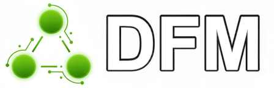
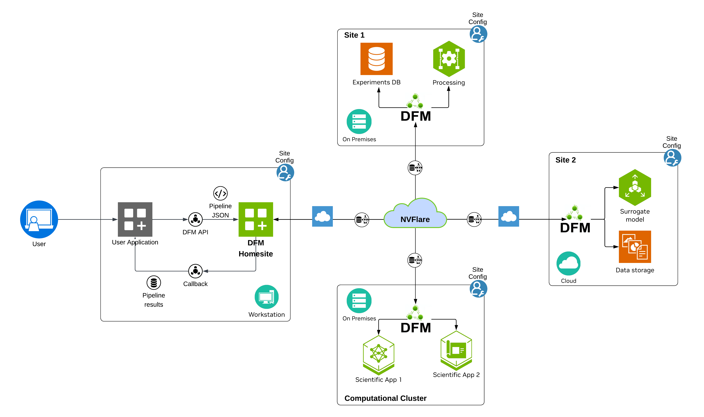

<!--
SPDX-FileCopyrightText: Copyright (c) 2026 NVIDIA CORPORATION & AFFILIATES. All rights reserved.
SPDX-License-Identifier: Apache-2.0

Licensed under the Apache License, Version 2.0 (the "License");
you may not use this file except in compliance with the License.
You may obtain a copy of the License at

http://www.apache.org/licenses/LICENSE-2.0

Unless required by applicable law or agreed to in writing, software
distributed under the License is distributed on an "AS IS" BASIS,
WITHOUT WARRANTIES OR CONDITIONS OF ANY KIND, either express or implied.
See the License for the specific language governing permissions and
limitations under the License.
-->

<!-- markdownlint-disable MD002 MD033 MD041 MD053 -->
<div align="center">

# NVIDIA Data Federation Mesh

Data Federation Mesh (DFM) is a Python-based framework designed to facilitate creation and orchestration of complex workflows processing data coming from various distributed sources, and streaming those data into applications. 
Our mission is creating smart system that determines for the user where to run each operation of a data processing pipeline and whether data need to be moved in order for each operation to function

<!-- markdownlint-disable MD036 -->
**- DFM Documentation -**
<!-- markdownlint-enable MD036 -->

[Install][dfm_install_url] | [User-Guide][dfm_userguide_url] |
[Tutorials][dfm_tutorials_url] | [API][dfm_api_url]



</div>

## Project Structure

This is a **monorepo** containing multiple Python packages:

| Package | Description |
|---------|-------------|
| `nv-dfm-core` | Core DFM package containing API, execution and generation engines and CLI |
| `nv-dfm-lib-common` | Common utilities shared across adapter libraries |
| `nv-dfm-lib-weather` | Weather and climate data adapters (GFS, ECMWF, HRRR, SFNO, cBottle) |

```
data-federation-mesh/
├── packages/
│   ├── nv-dfm-core/             # Core framework package
│   ├── nv-dfm-lib-common/       # Common utilities
│   └── nv-dfm-lib-weather/      # Weather adapters
├── ci/                          # CI/CD infrastructure
├── docs/                        # Documentation
├── tutorials/                   # Tutorials, examples and startup folder 
└── tests/                       # Unit tests
```

## Quick Start

### Installation from PyPI

```bash
# Install core framework only
pip install nv-dfm-core

# Install weather adapters library (see warning below)
pip install nv-dfm-lib-weather

# Install weather adapters with AI model support (requires GPU, see below)
pip install nv-dfm-lib-weather[cbottle]   # cBottle model adapters
pip install nv-dfm-lib-weather[sfno]      # SFNO model adapters
pip install nv-dfm-lib-weather[all]       # all AI model adapters
```

> **Note:** `nv-dfm-lib-weather` depends on `earth2studio`, which may require additional dependencies depending on your environment. The SFNO and cBottle AI model adapters additionally require a CUDA-capable NVIDIA GPU and model-specific setup. See the [installation guide][dfm_install_url] for full prerequisites.


### Development Setup

To work with the source, run tutorials, or contribute, clone the repository and use [uv](https://docs.astral.sh/uv/) to manage the workspace.

> **Note:** If you don't have `uv` installed, follow the [uv installation instructions](https://docs.astral.sh/uv/getting-started/installation/).

```bash
git clone https://github.com/NVIDIA/data-federation-mesh.git
cd data-federation-mesh
```

This is a multi-package workspace. Use `uv sync` to install packages into the local `.venv`:

```bash
# Install all workspace packages and their dependencies
uv sync --all-packages

# Install a single package (for example core only)
uv sync --package nv-dfm-core

# Install with tutorial extras (adds JupyterLab, ipywidgets, leafmap)
uv sync --all-packages --extra tutorials
```

> **Important:** Each `uv sync` invocation reconfigures the virtual environment to match
> exactly the requested set of packages. Syncing for a single package will remove
> dependencies that are not required by that package. Use `--all-packages` when you need
> the full workspace available.

### Examples

- Basic introduction into federation setup and adapters development, see [zero-to-thirty](./tutorials/zero-to-thirty/00-introduction.md) tutorial.

- To start your own federation from scratch: [cookiecutter startup folder](./tutorials/startup-fed/).  

- Tutorial on creating pipelines and using adapters for loading and processing weather data: [weather-fed](./tutorials/weather-fed/).

## Overview

DFM is a programmable framework for managing and orchestrating various services, distributed across potentially numerous sites, to collaborate and implement common functionalities. It is engineered to deliver "glue code as a service" to facilitate creating of complex pipelines and workflows to process data.

<div align="center">

</div>

DFM consists of multiple sites, which are groups of collocated services that are deployed together. Multiple sites communicating with each other in a peer-to-peer way, form a *federation*. 
DFM can be approached from the perspective of developers and users.
The developers implement functionality that each site provides, in the form of a plugin-like mechanism called *adapters*. The adapters are not exposed directly to the users, but rather assigned within the federation to a public interface called *operations*. 
The users create and submit data processing pipelines to the federation using provided operations API. 
DFM ensures execution of each operations on dedicated sites and transfer of data between sites.

### NVIDIA Flare 

DFM is built on top of [NVIDIA Flare](https://developer.nvidia.com/flare), which provides runtime services such as distributed messaging, job management, security, deployment, and simulation framework. 

### DFM Command Line Interface

**DFM CLI** is a command line tool that facilitates management of DFM and underlying NVIDIA Flare and provides a convenient way to perform many DFM-related tasks (including development tasks, such
as testing and linting). See [DFM CLI Documentation](https://nvidia.github.io/data-federation-mesh/userguide/cli/index.html) for details.

## Contributors

This project is currently not accepting contributions.

## License

DFM is provided under the Apache License 2.0, refer to the
[LICENSE file](LICENSE) for full license text.

<!-- Doc links -->
[dfm_docs_url]: https://nvidia.github.io/data-federation-mesh/index.html
[dfm_install_url]: https://nvidia.github.io/data-federation-mesh/userguide/about/installation.html
[dfm_userguide_url]: https://nvidia.github.io/data-federation-mesh/userguide/index.html
[dfm_tutorials_url]: https://nvidia.github.io/data-federation-mesh/tutorials.html
[dfm_api_url]: https://nvidia.github.io/data-federation-mesh/modules/index.html
[dfm_docs_cli]: https://nvidia.github.io/data-federation-mesh/userguide/cli/index.html