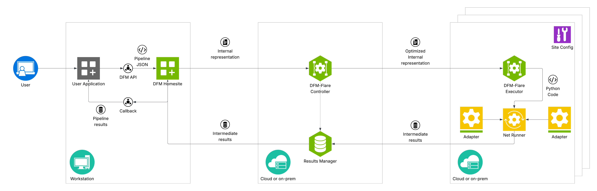

<!--
SPDX-FileCopyrightText: Copyright (c) 2026 NVIDIA CORPORATION & AFFILIATES. All rights reserved.
SPDX-License-Identifier: Apache-2.0

Licensed under the Apache License, Version 2.0 (the "License");
you may not use this file except in compliance with the License.
You may obtain a copy of the License at

http://www.apache.org/licenses/LICENSE-2.0

Unless required by applicable law or agreed to in writing, software
distributed under the License is distributed on an "AS IS" BASIS,
WITHOUT WARRANTIES OR CONDITIONS OF ANY KIND, either express or implied.
See the License for the specific language governing permissions and
limitations under the License.
-->

(introduction)=

# Introduction

## What is DFM?

**The Data Federation Mesh (DFM)** is a programmable framework for managing and orchestrating various heterogeneous services, distributed across potentially numerous sites, to collaborate and implement common functionalities. It is engineered to deliver "glue code as a service" to facilitate creating complex pipelines and workflows to process data.

## DFM versus Microservices

Unlike common microservice architectures, which often operate as fixed-function components, the DFM provides an additional layer of distributed control, particularly designed to execute programmable pipelines locally or on a cloud. As the "glue code," DFM focuses on integrating individual components, ensuring they work together seamlessly, and introducing dynamic behavior into the system, instead of performing heavy lifting computations by itself.

A primary objective of the DFM is to bring compute operations closer to the data, rather than transferring large datasets across networks. This helps to:

- Reduce latency
- Minimize resource overhead
- Lower bandwidth costs
- Keep data confidential by not requiring it to leave the premises

## Built on NVIDIA Flare

Built on top of [NVIDIA Flare](http://developer.nvidia.com/flare), the DFM is designed for privacy-preserving multi-party collaboration from diverse data sources without exposing the raw data. Its highly distributed architecture allows for deployment of compute networks that span:

- Regions
- Cloud providers
- On-premises data centers

These all work together as a unified system. DFM functions as a distributed virtual machine, composed of heterogeneous cloud services operating on top of external services and applications that do "heavy lifting". Each site administrator retains strict control over DFM capabilities offered by their own site, ensuring that data processing occurs within defined security boundaries and that the site's intellectual property and security are preserved.

## Architecture Overview

The diagram below provides a high-level overview of the DFM architecture, highlighting its distributed nature and how it fulfills the idea of bringing computational resources closer to data.

The DFM network comprises various interconnected sites, including:

- Dedicated on-premises environments (for example, computational clusters)
- Cloud-based deployments (for example, data source or AI inference)

Within each of these sites, DFM executors are deployed to interact with local resources through adapters, such as:

- Experiment databases
- Specialized processing units
- Scientific applications
- Data stores

DFM executors may be accompanied by additional computational environments (for example, Rapids/Dask clusters) for computationally intensive pre/post-processing operations. This decentralized deployment ensures that computation occurs close to where data resides, minimizing transfer costs and enhancing confidentiality.

## How It Works

A user's application (for example, an [NVIDIA Omniverse Kit application](https://docs.omniverse.nvidia.com/kit/docs/kit-manual/latest/guide/kit_overview.html) or a Jupyter Notebook) serves as a client where programmable pipelines are defined and submitted. These pipelines are then managed and orchestrated through NVIDIA Flare server, which acts as the central communication backbone for the distributed federation.

Each component within the distributed mesh is independently configurable by the local site administrator to tailor its specific role and resource utilization within the overall federation, including:

- The client application
- Individual sites
- Computational clusters

