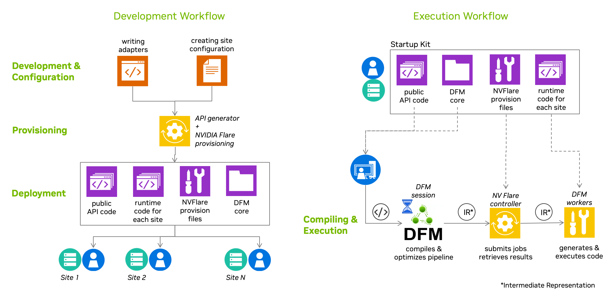

<!--
SPDX-FileCopyrightText: Copyright (c) 2026 NVIDIA CORPORATION & AFFILIATES. All rights reserved.
SPDX-License-Identifier: Apache-2.0

Licensed under the Apache License, Version 2.0 (the "License");
you may not use this file except in compliance with the License.
You may obtain a copy of the License at

http://www.apache.org/licenses/LICENSE-2.0

Unless required by applicable law or agreed to in writing, software
distributed under the License is distributed on an "AS IS" BASIS,
WITHOUT WARRANTIES OR CONDITIONS OF ANY KIND, either express or implied.
See the License for the specific language governing permissions and
limitations under the License.
-->

# DFM Workflow

Building and running a federation with the Data Federation Mesh involves a sequence of interconnected phases that span the entire lifecycle — from developing adapters through to executing pipelines across distributed sites.

## Building the Federation

These phases cover creating, configuring, and deploying a federation. They are typically performed once (or repeated as the federation evolves).

### 1. Development Time

Developers create [adapters](./adapters.md) that define the federation's functionality — how individual steps of a user's pipeline will be executed. Adapters may be specific to a particular federation or developed for broader reuse across multiple federations.

### 2. Configuration Time

For a specific federation, site administrators and the federation administrator decide how the functionality developed in adapters will be exposed to users and how individual sites participate. They collaborate to define the operations API and site configuration in the federation [configuration file](./federation_configuration.md). The [DFM CLI](../cli/index.md) provides tools for managing federation configurations, including listing, setting, showing, and deleting configurations. Site administrators have full control over their site's functionality by selecting DFM services to deploy, and configuring secrets and adapter parameters.

### 3. Provisioning Time

The federation administrator gathers the configuration files and runs the provisioning tool, which generates "startup kits" for each participating site and for users. These startup kits contain generated code, configurations, and certificates. The generated API is what users import in their application code to interact with the federation. The federation administrator then distributes the startup kits to all site administrators. See the [NVIDIA Flare guide](https://nvflare.readthedocs.io/en/2.6.2/real_world_fl/overview.html) for details on provisioning and startup kits.

### 4. Deployment Time

Once startup kits are distributed, site administrators deploy and start the federation's sites.

## Using the Federation

Once the federation is deployed, users can submit and execute pipelines against it. These phases happen each time a user runs a workload.

### 5. Pipeline Submission

The user's application assembles a pipeline — a description of computational tasks — and submits it to the federation for execution. Pipelines can target either a *local target* (execution on a single machine using multiprocessing, no deployed federation required) or a *flare target* (running across the deployed federation infrastructure based on NVIDIA Flare).

### 6. Compilation (Preparation and Optimization)

The submitted pipeline is compiled by an optimizing compiler on the *homesite*. DFM's IRGen component translates the pipeline into a Petri Net structure, assembles a placement graph, solves the placement problem to assign operations to capable sites, and prunes edges to create disconnected subgraphs for each site. This may include optimizations to minimize communication overhead by moving operations between sites. The result is a `PreparedPipeline` that the application can retain and submit for execution multiple times.

### 7. Execution

The compiled pipeline is submitted for execution. In a distributed scenario, the controller (the "Flare server") distributes work to workers ("Flare clients"). Execution is handled by a `NetRunner` component together with modules produced by the `ModGen` component, which implement the internal logic of each site's Petri Net subgraph. The `NetRunner` monitors transitions for activation based on input token availability, then fires them for execution. The application polls for results from the homesite, which manages the lifecycle of each request and buffers tokens on behalf of the application until polled.
